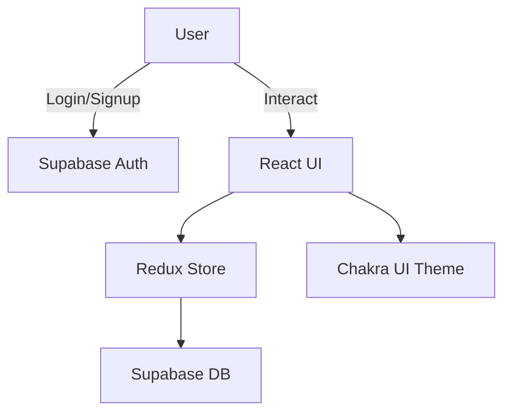

<h1 align="center">💰 Project Cost Tracker</h1>
<p align="center">
  <b>A modern web application to manage and track project expenses with ease.</b>
  <br>
  <i>Built with React, Redux, Chakra UI, and Supabase.</i>
</p>
<p align="center">
  <a href="https://github.com/chiragSahani/project-cost-tracker">
    
  </a>
 
  <a href="https://project-cost-tracker0.netlify.app/">
    
  </a>
  
</p>

---

## 🚀 Features


- 🔐 **Supabase Authentication:** Sign up & log in securely
- ➕ **Add / 🗑️ Delete Items & Costs:** Manage project expenses
- 📊 **Live Total Project Cost:** Real-time calculation
- 🗂️ **Redux Toolkit:** Robust state management
- 🎨 **Chakra UI:** Beautiful, accessible UI
- ☁️ **Supabase Backend:** PostgreSQL-powered data
- 💾 **LocalStorage:** Auth persistence
- 🧪 **TypeScript Support:** Type-safe codebase
- 📱 **Fully Responsive:** Optimized for all devices

---

## 🖼️ App Preview

---

## 🛠️ Tech Stack

| Frontend           | Styling     | State    | Backend    | Build Tool | Deploy   |
|--------------------|-------------|----------|------------|------------|----------|
| React (Vite)       | Chakra UI   | Redux    | Supabase   | Vite       | Netlify  |
| TypeScript         |             | Toolkit  | (Auth+DB)  |            |          |

---

## 📊 Architecture Overview



---

## 📁 Folder Structure

```bash
project-cost-tracker/
│
├── public/
│   ├── banner.png
│   ├── features.png
│   └── screenshot-dashboard.png
├── src/
│   ├── components/
│   │   └── Layout.tsx
│   ├── lib/
│   │   └── supabaseClient.ts
│   ├── pages/
│   │   ├── Dashboard.tsx
│   │   ├── Items.tsx
│   │   ├── OtherCosts.tsx
│   │   ├── Login.tsx
│   │   ├── SignUp.tsx
│   │   └── NotFound.tsx
│   ├── store/
│   │   └── authSlice.ts
│   ├── App.tsx
│   ├── main.tsx
│   ├── theme.ts
│   └── index.css
│
├── supabase/
│   └── migrations/
│       ├── 20250521091003_shiny_tower.sql
│       └── 20250521091144_fierce_feather.sql
├── package.json
├── postcss.config.js
├── vite-env.d.ts
└── index.html
```

---

## 🧪 Getting Started

1. **Clone the Repository**
    ```bash
    git clone https://github.com/chiragSahani/project-cost-tracker.git
    cd project-cost-tracker
    ```
2. **Install Dependencies**
    ```bash
    npm install
    ```
3. **Configure Supabase**  
   Replace the credentials in `src/lib/supabaseClient.ts`:
    ```ts
    export const supabase = createClient(
      'https://your-project-id.supabase.co',
      'your-anon-public-key'
    );
    ```
4. **Run Locally**
    ```bash
    npm run dev
    ```

---

## 🧾 Supabase SQL Schema

```sql
-- Items Table
CREATE TABLE items (
  id uuid PRIMARY KEY DEFAULT gen_random_uuid(),
  user_id uuid REFERENCES auth.users(id),
  name text NOT NULL,
  cost numeric NOT NULL,
  created_at timestamp DEFAULT now()
);

-- Other Costs Table
CREATE TABLE other_costs (
  id uuid PRIMARY KEY DEFAULT gen_random_uuid(),
  user_id uuid REFERENCES auth.users(id),
  label text NOT NULL,
  amount numeric NOT NULL,
  created_at timestamp DEFAULT now()
);
```

---

## 🙌 Contributing

Contributions, issues and feature requests are welcome!  
Feel free to check [issues page](https://github.com/chiragSahani/project-cost-tracker/issues) or open a [pull request](https://github.com/chiragSahani/project-cost-tracker/pulls).

---


  <b>Track. Manage. Innovate.</b>
</p>
